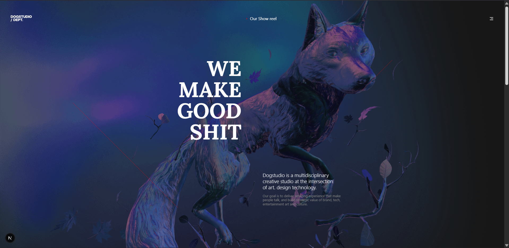
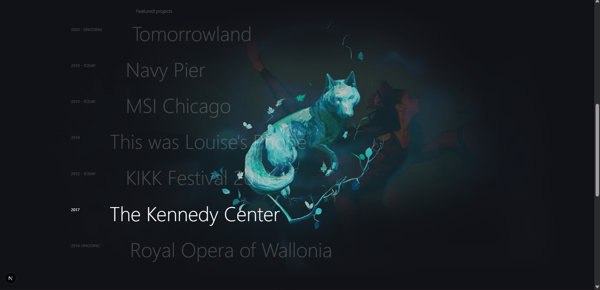
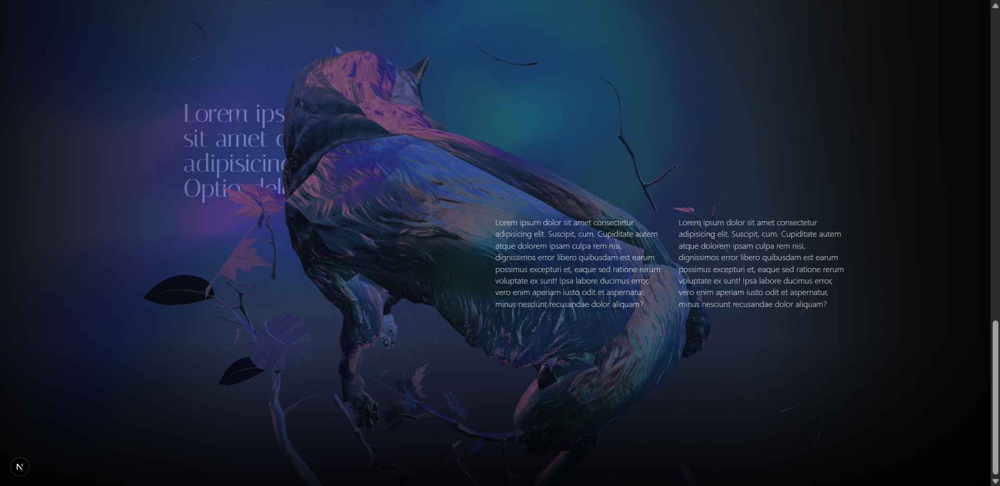

# DogStudio Portfolio (3D Interactive Web Experience)

A creative portfolio inspired by Dogstudio aesthetics, built with Next.js, React Three Fiber, GSAP, and Tailwind CSS.

This project combines:
- Real-time 3D rendering (dog model + material transitions)
- Scroll-based storytelling interactions
- Dynamic image and text behavior
- Custom typography using `next/font`

---

## Author

**Created by Rupayan Dey**

---

## Tech Stack

| Layer | Technology |
|---|---|
| Framework | Next.js 16 |
| UI Library | React 19 |
| 3D Engine | Three.js |
| React 3D | @react-three/fiber |
| 3D Helpers | @react-three/drei |
| Animation | GSAP + ScrollTrigger + @gsap/react |
| Styling | Tailwind CSS 4 + global CSS |
| Linting | ESLint + eslint-config-next |

---

## Required Modules

### Runtime Dependencies

| Package | Purpose |
|---|---|
| `next` | App framework and routing |
| `react` / `react-dom` | Component rendering |
| `three` | Core 3D rendering engine |
| `@react-three/fiber` | React renderer for Three.js |
| `@react-three/drei` | Useful helpers/loaders for R3F |
| `gsap` | Timeline and motion animation |
| `@gsap/react` | React integration for GSAP |

### Dev Dependencies

| Package | Purpose |
|---|---|
| `tailwindcss` | Utility-first styling |
| `@tailwindcss/postcss` | Tailwind PostCSS integration |
| `eslint` | Code linting |
| `eslint-config-next` | Next.js lint rules |

---

## Project Workflow

The project follows this interaction pipeline:

1. **Page Layout and Layering**
	- Fixed `Canvas` layer for 3D content
	- Content sections (`section-1`, `section-2`, `section-3`) on top
	- Overlay/mask layers for mood and focus effects

2. **3D Scene Initialization**
	- Load GLB model from `public/models`
	- Apply custom materials and matcap textures
	- Configure renderer, camera, and lighting

3. **Motion and Scroll Interactions**
	- GSAP timelines for model movement on scroll
	- ScrollTrigger-based text reveal animations
	- Reversible motion with scrubbed triggers

4. **Section-Based Visual Context**
	- Hover states in section-2 influence image overlays
	- Matcap transitions update model/leaf appearance
	- Section-3 introduces cinematic dark-edge window effect

5. **Typography and Branding**
	- Fonts loaded via `next/font/google`
	- Targeted font classes (e.g., Italiana/Lora) for specific headings

---

## Problems Faced & Solutions

| Problem Faced | Root Cause | Solution Implemented |
|---|---|---|
| Background image not showing | Incorrect file name/path and pseudo-element attached to canvas element | Corrected image path and moved background handling to reliable layering approach |
| `::after` on canvas not visible | `canvas` pseudo-element behavior is unreliable for this use case | Used non-canvas layering elements and fixed z-index structure |
| Leaves not changing color with dog | Branch material texture/map overrode visible matcap transition | Synced branch material transition pipeline and adjusted material setup |
| Section-3 left content disappearing | Negative z-index pushed content behind visible layers | Reworked stack order using explicit non-negative z-index hierarchy |
| Scroll reveal not reversing smoothly | One-way trigger behavior | Switched to scrub-based ScrollTrigger range for symmetric in/out motion |
| Blackish window effect missing | No dedicated overlay layer tied to section scroll | Added fixed gradient mask + GSAP opacity trigger in section-3 |
| Italiana font not applying | Google font stylesheet not reliably injected through metadata link usage | Migrated to `next/font/google` with variable-based font usage |
| Need different heading font in section-1 | Font was not scoped to target heading | Added `Lora` via `next/font/google` and scoped to section-1 `h1` |

---

## Folder Highlights

| Path | Description |
|---|---|
| `app/page.jsx` | Main page layout, sections, GSAP scroll logic |
| `app/components/Dog.js` | 3D model load, materials, matcap transitions |
| `app/globals.css` | Global styles, overlays, section layering |
| `public/models` | 3D model assets |
| `public/matcap` | Matcap texture set |
| `public/screenshots` | README preview screenshots |

---

## Screenshots

> Images are sourced from `public/screenshots`.

### 1) Hero / Intro



### 2) Projects / Mid Scroll



### 3) Section-3 / Overlay + Content



---

## Getting Started

### 1) Install dependencies

```bash
npm install
```

### 2) Run development server

```bash
npm run dev
```

### 3) Open in browser

Visit: `http://localhost:3000`

---

## Build & Production

```bash
npm run build
npm run start
```

---

## Notes

- This README is GitHub-compatible markdown.
- All screenshot links use repository-relative paths.
- 3D assets and textures must remain in `public` for correct runtime loading.

